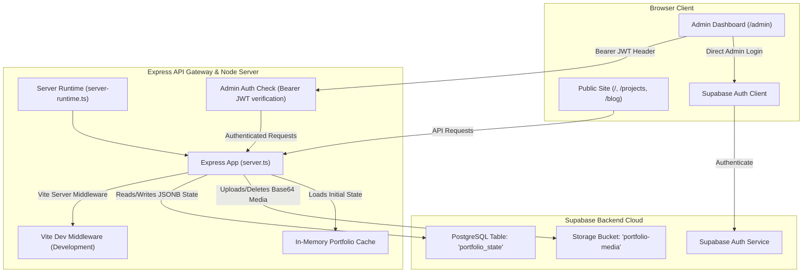

# ⚡ Full-Stack Portfolio & Admin Panel

[](#)
[](#)
[](#)
[](#)
[](#)
[](#)
[](#)

A flagship, production-ready, full-stack portfolio application. It combines a visually stunning, responsive, interactive user-facing portfolio with a secure, powerful Admin Dashboard for real-time content management.

Instead of writing changes directly to static files or complex database tables, the system uses a high-performance **Single-Instance JSONB State Model** on Supabase. This caches data on the server for swift response times and syncs live changes seamlessly.

---

## 🌟 Key Features

### 💻 Public-Facing Portfolio
- **Projects Showcase**: Interactive grid with filtering, featuring deep modal details, client info, GitHub repo links, live demo links, and gallery lists.
- **Timeline Chronicles**: Interactive timeline displaying professional experience and educational background.
- **Skills Matrix**: Category-wise (Frontend, Backend, Cloud, Databases, Architecture) proficiency tracker.
- **Developer Journal (Blog)**: Markdown-ready blogging engine with read-time estimators and tags.
- **Social Proof**: Client testimonials and star ratings.
- **Integrated Inbox**: Public contact form sending inquiries directly into the secure admin mailbox in real-time.
- **Resume Download**: Hero and About “Resume / CV” buttons download the **file you uploaded in the Admin Panel** (`profile.resumeUrl`). If no resume is uploaded, a preview modal with a text export is used as fallback.

### 🛡️ Admin Dashboard (`/admin`)
- **Supabase Authentication**: Secure login gateway using Supabase JSON Web Tokens (JWT).
- **System Configuration**: Real-time updates to bio, contact information, profile pictures, SEO defaults.
- **Resume / CV Upload**: Upload a PDF (or paste an external URL). Stored in Supabase Storage and saved as `profile.resumeUrl` for the public site.
- **Full CRUD Panels**: Manage projects, blog posts (draft/publish), skills, experience, education, and testimonials.
- **Project helpers**:
  - GitHub Repo URL and Live Demo URL fields
  - **Import README from GitHub** (pulls public `README.md` into project description)
  - **Upload README.md file** as project description (Markdown)
- **Interactive Inbox**: Messages from the public site with read/unread flags and deletion.
- **Media Asset Manager**: Uploads (Base64 → Supabase Storage) with public CDN URLs.

---

## 🏗️ System Architecture

The project features a **monorepo-style single-port environment** for development. The Express server encapsulates the Vite development server in non-production environments to avoid CORS setup.



---

## 💾 Database Schema & Storage

The Postgres database structure is optimized for rapid CRUD and caching. Rather than utilizing joins across multiple tables, we store all structured data in a single document-oriented JSONB field.

### PostgreSQL Table: `public.portfolio_state`
| Column | Type | Constraints | Description |
| :--- | :--- | :--- | :--- |
| `id` | `text` | `PRIMARY KEY` (Must be `'primary'`) | Enforces a single row to represent the system state. |
| `data` | `jsonb` | `NOT NULL` | The complete serialized portfolio state matching the TS interface. |
| `updated_at` | `timestamptz` | `NOT NULL DEFAULT now()` | Tracks system state changes. |

> [!NOTE]
> **Row Level Security (RLS)** is enabled on `portfolio_state`. All browser-direct access is revoked; only the Express API holds the Supabase `service_role` key to interact with this table.

### Storage Bucket: `portfolio-media`
- Used to store public assets (avatars, banners, project galleries, **resume PDFs**).
- **Security Policy**: Read access is granted to the `public`. Write/Delete access is restricted exclusively to the server via the `service_role` client.

---

## 🔌 API Reference

### 🌐 Public Endpoints
All public endpoints are accessible without authentication.
* **`GET /api/health`**: Simple health check.
* **`GET /api/public/data`**: Returns public profile (including `resumeUrl`), published projects, published blog posts, visible testimonials, skills, experiences, and education.
* **`GET /api/public/projects/:slug`**: Returns project details matching a unique slug.
* **`GET /api/public/blog/:slug`**: Returns blog post content matching a unique slug.
* **`POST /api/public/messages`**: Submits a contact form message.

### 🔑 Admin Endpoints
Require the `Authorization: Bearer <Supabase_JWT>` header.

#### Auth & data
* **`POST /api/admin/login`**: Authenticates credentials and returns a session token.
* **`GET /api/admin/verify`**: Validates the active admin session token.
* **`GET /api/admin/data`**: Retrieves full state (drafts, messages, media, raw config).
* **`PUT /api/admin/profile`**: Updates general settings, contact bio, and profile fields.

#### Resume
* **`POST /api/admin/resume`**: Upload resume PDF/DOC as Base64 data-URL. Stores in Supabase Storage and sets `profile.resumeUrl`. Also adds an entry to the media library.
* **`PUT /api/admin/resume`**: Set or clear `profile.resumeUrl` with an external URL string (`{ "resumeUrl": "https://..." }`).

#### Projects
* **`POST /api/admin/projects`**: Create a project.
* **`PUT /api/admin/projects/:id`**: Update a project.
* **`DELETE /api/admin/projects/:id`**: Delete a project.
* **`POST /api/admin/projects/fetch-readme`**: Given `{ "repoUrl": "https://github.com/user/repo" }`, returns the public `README.md` content for use as project description.

**Project create/update body helpers** (`POST` / `PUT /api/admin/projects`):
| Field | Description |
| :--- | :--- |
| `repoUrl` (or `githubUrl`) | GitHub repository link |
| `liveUrl` (or `demoUrl`) | Live demo URL |
| `description` | Markdown case-study body |
| `readme` / `readmeContent` | Pasted Markdown used as description if `description` is empty |
| `readmeFile` | Base64 data-URL of a `.md` file → decoded into description |
| `fetchReadme: true` | Auto-import `README.md` from the GitHub repo into `description` |
| `techStack` / `tags` | Array **or** comma-separated string |

#### Other CRUD
* **`POST/PUT/DELETE /api/admin/blog`**: Manage blog posts.
* **`POST/PUT/DELETE /api/admin/testimonials`**: Manage testimonials.
* **`POST/PUT/DELETE /api/admin/skills`**: Manage skills.
* **`POST/PUT/DELETE /api/admin/experience`**: Manage experience.
* **`POST/PUT/DELETE /api/admin/education`**: Manage education.
* **`PUT /api/admin/messages/:id/read`**: Update message read/unread status.
* **`DELETE /api/admin/messages/:id`**: Delete a contact inquiry.
* **`POST /api/admin/media`**: Upload a media asset (Base64 data-URL).
* **`DELETE /api/admin/media/:id`**: Delete a media asset from Storage and state.

---

## 📄 Resume flow (Admin → Public)

1. Log in at `/admin` → **Profile** tab.
2. Under **RESUME / CV UPLOAD**, choose a PDF (or paste an external URL) and save profile if needed.
3. Backend stores the file in `portfolio-media` and sets `profile.resumeUrl`.
4. On the public site, **Hero → Resume** and **About → Download Curriculum Vitae**:
   - If `profile.resumeUrl` is set → download/open **your uploaded file**.
   - If not set → open the resume preview modal (text export fallback only).

> Ensure you uploaded a resume in Admin and that `resumeUrl` is non-empty. Otherwise the site will still use the auto-generated text fallback.

---

## 🚀 Getting Started

### 📋 Prerequisites
- **Node.js**: `v18.x` or higher
- **Package Manager**: `npm`, `yarn`, or `bun`
- A **Supabase** account

### ⚙️ Step-by-Step Installation

#### 1. Setup Local Environment Variables
Create a `.env.local` file in the root directory:
```bash
cp .env.example .env.local
```
Fill in the configuration details:
```env
SUPABASE_URL=your_supabase_project_url
SUPABASE_ANON_KEY=your_supabase_anon_key
SUPABASE_SERVICE_ROLE_KEY=your_supabase_service_role_key
ADMIN_EMAIL=your_admin_email@example.com
PORT=3000
```
> [!IMPORTANT]
> The `SUPABASE_SERVICE_ROLE_KEY` has full access to bypass RLS policies. It **must never** be shared publicly or included in client bundle files.

#### 2. Run Database Migration
- In your Supabase Project Dashboard, navigate to the **SQL Editor**.
- Click **New query**, paste the contents of `supabase/migrations/20260725_portfolio.sql`, and click **Run**.
- This creates the `portfolio_state` table, enables Row Level Security, revokes direct public query privileges, and initializes the `portfolio-media` storage bucket with correct permissions.

#### 3. Install Dependencies
```bash
npm install
# or if you use bun:
bun install
```

#### 4. Seed the Database
Run the seeding script to populate the Supabase DB with default profile data from `server/initialData.ts`:
```bash
npm run db:seed
```

#### 5. Register Admin User
- In your Supabase Dashboard, go to **Authentication** → **Users**.
- Click **Add User** → **Create User**.
- Enter the email specified as your `ADMIN_EMAIL` in the `.env.local` file and choose a secure password.
- Confirm the user registration (or disable email confirmation in Auth settings).

#### 6. Start the Server
```bash
npm run dev
```
Open [http://localhost:3000](http://localhost:3000) to view the portfolio. Configure content at `/admin`.

---

## 🛠️ Scripts Reference

| Command | Action |
| :--- | :--- |
| `npm run dev` | Development server with Vite HMR middleware. |
| `npm run build` | Builds client via Vite and bundles server with esbuild. |
| `npm run start` | Runs production Express server (`dist/server.cjs`). |
| `npm run preview` | Vite preview of client bundles. |
| `npm run clean` | Deletes `dist/` and cached server files. |
| `npm run db:seed` | Seeds Supabase with default portfolio data. |
| `npm run lint` | TypeScript check (`tsc --noEmit`). |

---

## 📁 Notable source files

| File | Role |
| :--- | :--- |
| `server.ts` | Express API: public + admin CRUD, resume upload, GitHub README fetch |
| `server/store.ts` | Supabase load/save, auth, media upload/delete |
| `server/initialData.ts` | Default seed data |
| `src/App.tsx` | Public routing; resume button uses `profile.resumeUrl` when set |
| `src/components/public/ResumeModal.tsx` | Resume preview; download prefers uploaded file |
| `src/components/admin/AdminDashboard.tsx` | Admin CRUD UI, resume upload, project GitHub/README fields |
| `src/types.ts` | Shared TypeScript interfaces (`Profile.resumeUrl`, `Project.repoUrl`, etc.) |
| `supabase/migrations/20260725_portfolio.sql` | Table + storage bucket setup |

---

## ☁️ Deployment Guide

### Vercel Deployment
Configured for serverless execution on **Vercel** via `vercel.json` rewrites:

1. **Import Project**: Link your GitHub repository to Vercel.
2. **Framework Preset**: Choose **Vite**.
3. **Build settings**:
   - Build Command: `npm run build`
   - Output Directory: `dist`
4. **Environment Variables**:
   - `SUPABASE_URL`
   - `SUPABASE_ANON_KEY`
   - `SUPABASE_SERVICE_ROLE_KEY`
   - `ADMIN_EMAIL`
   - `NODE_ENV=production`
5. **Finalize Auth**: In **Supabase** → **Authentication** → **URL Configuration**, set **Site URL** to your Vercel URL.

---

## 📄 License
This project is open-source and available under the [MIT License](LICENSE).
