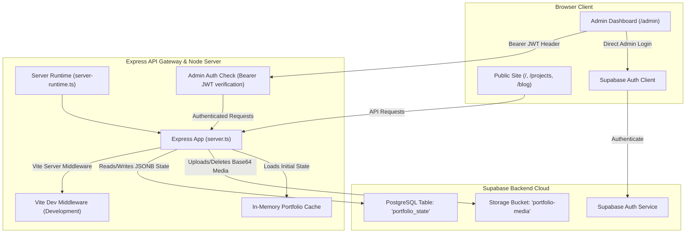

# ⚡ Full-Stack Portfolio & Admin Panel

[](#)
[](#)
[](#)
[](#)
[](#)
[](#)
[](#)

A flagship, production-ready, full-stack portfolio application. It combines a visually stunning, responsive, interactive user-facing portfolio with a secure, powerful Admin Dashboard for real-time content management. 

Instead of writing changes directly to static files or complex database tables, the system uses a high-performance **Single-Instance JSONB State Model** on Supabase. This caches data on the server for swift response times and syncs live changes seamlessly.

---

## 🌟 Key Features

### 💻 Public-Facing Portfolio
- **Projects Showcase**: Interactive grid with filtering, featuring deep modal details, client info, repo links, and gallery lists.
- **Timeline Chronicles**: Tabbed, interactive timeline displaying professional experience and educational background.
- **Skills Matrix**: Category-wise (Frontend, Backend, Cloud, Databases, Architecture) proficiency tracker.
- **Developer Journal (Blog)**: Markdown-ready blogging engine with read-time estimators, search filters, and tag search.
- **Social Proof**: Carousel of client testimonials and star ratings.
- **Integrated Inbox**: Public contact form sending inquiries directly into the secure admin mailbox in real-time.

### 🛡️ Admin Dashboard (`/admin`)
- **Supabase Authentication**: Secure login gateway using Supabase JSON Web Tokens (JWT) for authentication.
- **System Configuration**: Real-time updates to bio, contact information, profile pictures, resume file links, and SEO defaults.
- **Full CRUD Panels**: Manage project listings, blog posts (draft/publish states), skills, experience, education, and testimonials.
- **Interactive Inbox**: Real-time list of messages from the public site with read/unread flags and message deletion.
- **Media Asset Manager**: Centralized uploads library. Converts local uploads to Base64 on the fly and uploads them to the Supabase Storage Bucket, automatically serving public CDN URLs.

---

## 🏗️ System Architecture

The project features a **monorepo-style single-port environment** for development. The Express server encapsulates the Vite development server in non-production environments to avoid CORS setup.



---

## 💾 Database Schema & Storage

The Postgres database structure is optimized for rapid CRUD and caching. Rather than utilizing joins across multiple tables, we store all structured data in a single document-oriented JSONB field.

### PostgreSQL Table: `public.portfolio_state`
| Column | Type | Constraints | Description |
| :--- | :--- | :--- | :--- |
| `id` | `text` | `PRIMARY KEY` (Must be `'primary'`) | Enforces a single row to represent the system state. |
| `data` | `jsonb` | `NOT NULL` | The complete serialized portfolio state matching the TS interface. |
| `updated_at` | `timestamptz` | `NOT NULL DEFAULT now()` | Tracks system state changes. |

> [!NOTE]
> **Row Level Security (RLS)** is enabled on `portfolio_state`. All browser-direct access is revoked; only the Express API holds the Supabase `service_role` key to interact with this table.

### Storage Bucket: `portfolio-media`
- Used to store public assets (avatars, banners, project galleries, resume PDFs).
- **Security Policy**: Read access is granted to the `public`. Write/Delete access is restricted exclusively to the server via the `service_role` client.

---

## 🔌 API Reference

### 🌐 Public Endpoints
All public endpoints are accessible without authentication.
* **`GET /api/health`**: Simple health check.
* **`GET /api/public/data`**: Returns all public profiles, published projects, published blog posts, visible testimonials, skills, experiences, and education.
* **`GET /api/public/projects/:slug`**: Returns project details matching a unique slug.
* **`GET /api/public/blog/:slug`**: Returns blog post content matching a unique slug.
* **`POST /api/public/messages`**: Submits a contact form message.

### 🔑 Admin Endpoints
Require the `Authorization: Bearer <Supabase_JWT>` header.
* **`POST /api/admin/login`**: Authenticates credentials and returns a session token.
* **`GET /api/admin/verify`**: Validates the active admin session token.
* **`GET /api/admin/data`**: Retrieves full state details (including draft posts, deleted items, messages, and raw configurations).
* **`PUT /api/admin/profile`**: Updates general settings, contact bio, and profile fields.
* **`POST/PUT/DELETE /api/admin/projects`**: Manage projects.
* **`POST/PUT/DELETE /api/admin/blog`**: Manage blog posts.
* **`POST/PUT/DELETE /api/admin/testimonials`**: Manage client testimonials.
* **`POST/PUT/DELETE /api/admin/skills`**: Manage tech skills.
* **`POST/PUT/DELETE /api/admin/experience`**: Manage professional experience.
* **`POST/PUT/DELETE /api/admin/education`**: Manage education records.
* **`PUT /api/admin/messages/:id/read`**: Updates message read/unread status.
* **`DELETE /api/admin/messages/:id`**: Deletes a contact inquiry.
* **`POST /api/admin/media`**: Uploads a new media asset (expects Base64 representation).
* **`DELETE /api/admin/media/:id`**: Deletes a media asset from Supabase Storage and updates references.

---

## 🚀 Getting Started

### 📋 Prerequisites
- **Node.js**: `v18.x` or higher
- **Package Manager**: `npm`, `yarn`, or `bun`
- A **Supabase** account

### ⚙️ Step-by-Step Installation

#### 1. Setup Local Environment Variables
Create a `.env.local` file in the root directory:
```bash
cp .env.example .env.local
```
Fill in the configuration details:
```env
SUPABASE_URL=your_supabase_project_url
SUPABASE_ANON_KEY=your_supabase_anon_key
SUPABASE_SERVICE_ROLE_KEY=your_supabase_service_role_key
ADMIN_EMAIL=your_admin_email@example.com
PORT=3000
```
> [!IMPORTANT]
> The `SUPABASE_SERVICE_ROLE_KEY` has full access to bypass RLS policies. It **must never** be shared publicly or included in client bundle files.

#### 2. Run Database Migration
- In your Supabase Project Dashboard, navigate to the **SQL Editor**.
- Click **New query**, paste the contents of `supabase/migrations/20260725_portfolio.sql`, and click **Run**.
- This creates the `portfolio_state` table, enables Row Level Security, revokes direct public query privileges, and initializes the `portfolio-media` storage bucket with correct permissions.

#### 3. Install Dependencies
```bash
npm install
# or if you use bun:
bun install
```

#### 4. Seed the Database
Run the seeding script to populate the Supabase DB with default profile data from `server/initialData.ts`:
```bash
npm run db:seed
```

#### 5. Register Admin User
- In your Supabase Dashboard, go to **Authentication** -> **Users**.
- Click **Add User** -> **Create User**.
- Enter the email specified as your `ADMIN_EMAIL` in the `.env.local` file and choose a secure password.
- Confirm the user registration (or disable email confirmation in Auth settings).

#### 6. Start the Server
Start the unified full-stack application:
```bash
npm run dev
```
Open [http://localhost:3000](http://localhost:3000) to view the portfolio. To configure settings, head to `/admin` and log in.

---

## 🛠️ Scripts Reference

The `package.json` contains several helper tasks for development and deployment:

| Command | Action |
| :--- | :--- |
| `npm run dev` | Runs the server in development mode utilizing `tsx` and hot-module Vite replacement middleware. |
| `npm run build` | Builds the client assets via Vite and bundles the server entry point using `esbuild`. |
| `npm run start` | Launches the built production Express server (`dist/server.cjs`). |
| `npm run preview` | Runs the local Vite preview server to inspect client bundles. |
| `npm run clean` | Deletes build outputs (`dist/`) and cached server files. |
| `npm run db:seed` | Populates the remote Supabase database with default schemas. |
| `npm run lint` | Runs the TypeScript compiler check on all code directories. |

---

## ☁️ Deployment Guide

### Vercel Deployment
This repository is configured out-of-the-box for serverless execution on **Vercel** via API rewrites (`vercel.json`):

1. **Import Project**: Link your GitHub repository to Vercel.
2. **Framework Preset**: Choose **Vite**.
3. **Build settings**:
   - Build Command: `npm run build`
   - Output Directory: `dist`
4. **Environment Variables**: Add your production credentials:
   - `SUPABASE_URL`
   - `SUPABASE_ANON_KEY`
   - `SUPABASE_SERVICE_ROLE_KEY`
   - `ADMIN_EMAIL`
   - `NODE_ENV=production`
5. **Finalize Auth**: Update the Site URL in **Supabase Dashboard** -> **Authentication** -> **URL Configuration** -> **Site URL** with your deployed Vercel URL to secure redirect routes.

---

## 📄 License
This project is open-source and available under the [MIT License](LICENSE).
